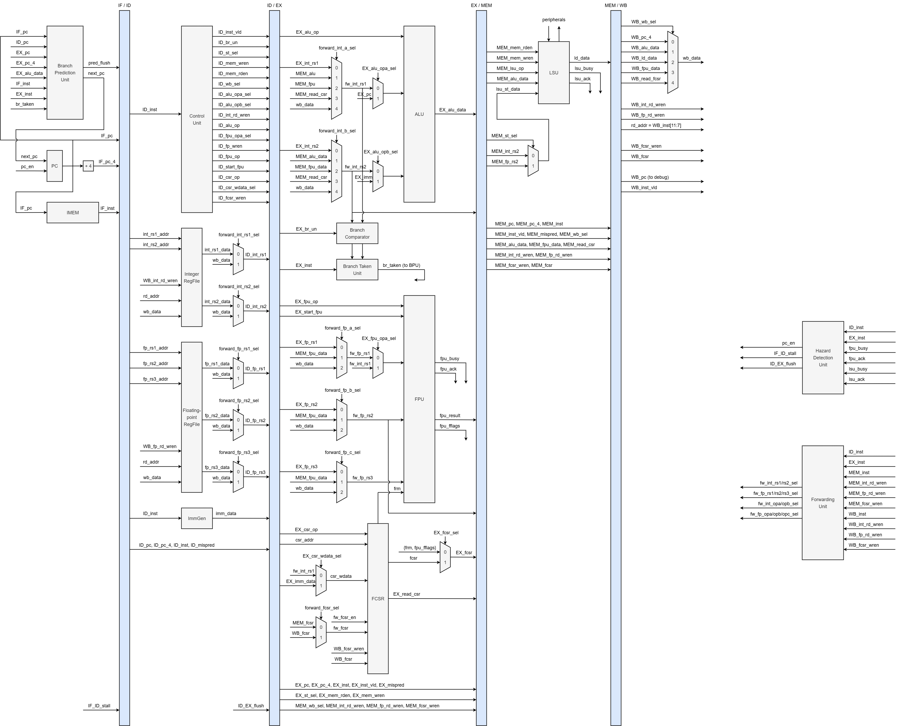
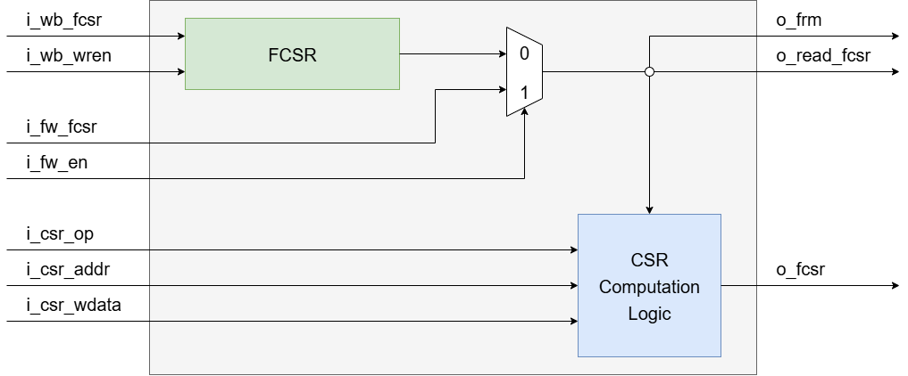
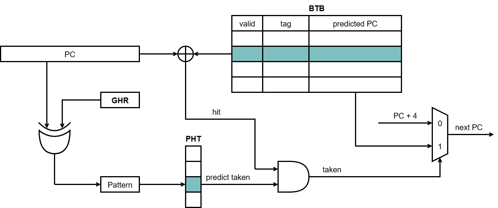

# 5-Stage Pipelined RV32IF Processor

## Overview

This project represents a Graduation Thesis focused on the design and implementation of a RISC-V processor supporting the RV32IF Instruction Set Architecture (ISA). Developed at the Register Transfer Level (RTL) using SystemVerilog, the processor is optimized for deployment on FPGA platforms.

The primary objective is to construct a robust CPU capable of executing basic integer operations (RV32I) alongside single-precision floating-point arithmetic (RV32F), fully compliant with the IEEE-754 standard.

## Project Details

- **Author**: Gia Huy Le
- **Institution**: Ho Chi Minh City University of Technology (HCMUT) - VNU-HCM

## Key Features

- **RV32I Base Integer ISA**: Comprehensive support for 32-bit integer instructions.
- **RV32F Extension**: Integrated Floating-Point Unit (FPU) enabling addition, subtraction, multiplication, division (multi-cycle), square root (multi-cycle), and Fused Multiply-Add (FMA) operations.

  **Supported Rounding Modes:**

  | Rounding Mode | Abbrev. | Encoding |
  | :--- | :---: | :---: |
  | Round to Nearest, ties to Even | RNE | 000 |
  | Round towards Zero | RTZ | 001 |
  | Round Down (towards $-\infty$) | RDN | 010 |
  | Round Up (towards $+\infty$) | RUP | 011 |
  | Round to Nearest, ties to Max Magnitude | RMM | 100 |

- **Zicsr Extension**: Implementation of Floating-Point Control and Status Registers (FCSR) for FPU status management, including support for 5 rounding modes and exception flags.

  - **FCSR Register Layout:**
  The `fcsr` is a 32-bit control and status register divided into the following fields:

    | Bits | Field | Description |
    | :--- | :--- | :--- |
    | `31:8` | **Reserved** | Reserved for future use |
    | `7:5` | **frm** | Rounding Mode (5 modes) |
    | `4:0` | **fflags** | Accrued Exceptions |

  - **Accrued Exception Flags:**
  The `fflags` field (bits 4:0) contains the following status flags:

    | Bit | Acronym | Meaning |
    | :---: | :--- | :--- |
    | 4 | **NV** | Invalid Operation |
    | 3 | **DZ** | Divide by Zero |
    | 2 | **OF** | Overflow |
    | 1 | **UF** | Underflow |
    | 0 | **NX** | Inexact |

    > **Note:** These flags are "sticky", meaning they remain set until explicitly cleared by software writing to the `fcsr`.

- **5-Stage Pipeline**: Optimized classic pipeline architecture comprising Instruction Fetch (IF), Instruction Decode (ID), Execute (EX), Memory Access (MEM), and Write-Back (WB) stages.
- **Hazard Handling**: Forwarding Unit and Hazard Detection Unit to effectively manage data and control hazards.
- **Dynamic Branch Prediction**: G-share predictor utilizing a Global History Register (GHR) and Branch Target Buffer (BTB).
- **Memory-Mapped I/O**: Interface with IMEM, DMEM, and hardware peripherals on the FPGA kit (LEDs, Switches, 7-Segment displays, LCD).

## System Architecture

The processor is designed with a modular architecture, incorporating the following core components:

- **Integer Path (ALU)**: Handles combinational logic and arithmetic operations for integers.
- **Floating-Point Unit (FPU)**: Specialized unit employing FSM-driven logic for complex operations such as restorative division and square root.
- **FCSR Unit**: Manages the Floating-Point Control and Status Register. It tracks exception flags (e.g., overflow, invalid operation) and defines rounding modes required by the IEEE 754 standard, ensuring precise control over floating-point execution.
    
- **Branch Prediction Unit (BPU)**: Minimizes pipeline stalls through predictive branch outcome analysis using a G-share predictor mechanism.
    
- **Load/Store Unit (LSU)**: Manages data alignment and facilitates communication with peripherals. The memory mapping system is organized as follows:

  | Boundary Address | Mapping |
  | :--- | :--- |
  | `0x7820` -- `0xFFFF` | (Reserved) |
  | `0x7810` -- `0x781F` | Buttons |
  | `0x7800` -- `0x780F` | Switches |
  | `0x7040` -- `0x70FF` | (Reserved) |
  | `0x7030` -- `0x703F` | LCD Control Registers |
  | `0x7020` -- `0x7027` | Seven-segment LEDs |
  | `0x7010` -- `0x701F` | Green LEDs |
  | `0x7000` -- `0x700F` | Red LEDs |
  | `0x4000` -- `0x6FFF` | (Reserved) |
  | `0x2000` -- `0x3FFF` | Data Memory (8KiB using RAM) |
  | `0x0000` -- `0x1FFF` | Instruction Memory (8KiB) |

## Simulation & Deployment

- **Simulation**: Verified using ModelSim with extensive SystemVerilog testbenches covering individual modules and full-system integration.
- **Synthesis**: Successfully synthesized with Quartus II 13.0sp1.
- **Hardware Deployment**: Implemented on the Altera DE2 (Cyclone II EP2C35F672C6) FPGA kit.
- **Demo Applications**: Executed Assembly programs including Factorial calculation, Greatest Common Divisor (GCD), and Hypotenuse calculation (Pythagorean theorem) leveraging FPU instructions.

## References

- Andrew Waterman & Krste Asanović, *The RISC-V Instruction Set Manual, Volume I: Unprivileged ISA*, Document Version 20191213. Available at [riscv.org](https://riscv.org).
- IEEE Computer Society, *IEEE Standard for Floating-Point Arithmetic (IEEE Std 754-2008)*. Available on [IEEE Xplore](https://ieeexplore.ieee.org).
- Sarah L. Harris & David Harris, *Digital Design and Computer Architecture: RISC-V Edition*. Available on [Morgan Kaufmann](https://www.mkp.com).
- Terasic Inc., *DE2 Development and Education Board User Manual*. Download from [Terasic](https://www.terasic.com.tw).

## Acknowledgments

Special thanks to [Lampro-Mellon/Caravel_FPU](https://github.com/Lampro-Mellon/Caravel_FPU) for providing the foundational code used in developing the Floating-Point Unit (FPU).
